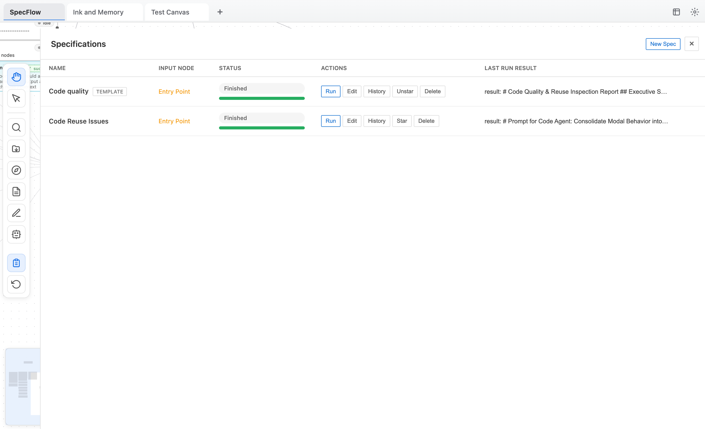

[English](README.md) | 简体中文

SpexFlow 是一个基于 React Flow 的可视化 context/spec 工作流工具。它帮助你把一个明确的功能需求变成：

1) 可复用、可缓存的仓库上下文（代码搜索 / 手动选择），再  
2) 由 LLM 生成的高质量实现方案（spec/plan），再  
3) 一段可以直接丢给"上下文清空"的 code agent（Codex / Claude Code / 等）的 prompt。

目标不是"把整套系统一次写完"，而是 **一次性把一个定义清楚的功能点做对**。

## 截图

**最小工作流**（instruction → code-search → context → LLM）：


**更大的画布**：把一些可复用的 context/指令块当作"积木"保存起来，需要更新时只 rerun 那个节点：


**两次迭代的代码搜索和规划**


**规格面板**：管理规格运行并收集输出：



## 你能用它做什么

SpexFlow 用来加载本地代码仓库，并用一个小型「节点工作流」跑通：

- **Instruction** → 生成/组合纯文本输入
- **Code Search Conductor** → 为多个下游 Code Search 节点分别生成互补的搜索查询
- **Code Search**（Relace fast agentic search）→ 返回 `{ explanation, files }`
- **Manual Import** → 手动选择文件/文件夹并产出同样的 `{ explanation, files }` 结构（不做外部搜索）
- **Context Converter** → 把文件片段转成带行号的文本上下文
- **LLM** → 输入上下文 + prompt，生成输出（spec/plan 等）

## 前置要求

- Node.js 18+
- pnpm 9+

## 快速开始

### 1) 安装

```bash
pnpm install
```

### 2) 启动

```bash
pnpm dev
```

- Web UI：打开终端输出的 Vite 地址（通常是 `http://localhost:5173`）
- 后端健康检查：`curl http://localhost:3001/api/health`

### 3) 配置 key（推荐）

点右上角 **Settings**：

- **Code Search**：填 Relace API key（[获取方式](https://docs.relace.ai/docs/introduction)）
- **LLM**：配置 provider / model（需要 OpenAI 兼容的 chat-completions 接口）

### 4) 跑一条最小工作流

用默认 canvas 或自己搭一条：

```
instruction → code-search → context-converter → llm
```

把 LLM 输出复制出来，直接丢给你的 code agent。

## 核心概念

### Canvas = 可缓存的流水线

- 一个 canvas 是有向图（nodes + edges）。
- 每个节点都有 **输入**（上游边）和 **输出**（写回到节点上）。
- 输出会持久化到本地 `data.json`，因此你可以复用历史结果，只 rerun 变更的节点。

### Run vs Chain

- **Run**：只跑一个节点；只要连了上游，就必须所有上游节点为 `success`。
- **Chain**：从一个节点开始跑整条下游子图，按依赖关系调度，并在 **Chain Manager** 展示进度。

### Locked / Muted

- **Locked**：不可拖拽；Chain 不会 reset 它；适合"稳定的缓存 context"。
- **Muted**：直接产出空输出（不发 API）；适合临时禁用一个分支。

### Spec Dashboard

- 规格独立于画布，只通过节点 ID 关联输入与输出。
- 运行规格会把内容注入输入节点，然后从该节点开始 chain run。
- 规格会从指定输出节点收集结果，并保存在运行历史里。
- 把规格 **标为模板** 后可快速新建同输入/输出映射的规格。

## 节点类型

### `instruction`

- 作用：写需求/约束/验收标准，或者把上游文本拼接成更完整的指令。
- 输入：可选的上游文本节点。
- 输出：拼接后的单个字符串。

### `code-search-conductor`

- 作用：为多个下游 `code-search` 生成互补的查询（按节点 id 分配）。
- 输入：可选上游文本 + 自己的 query。
- 输出：`{ successor_node_id -> query }` 的 JSON。
- 要求：必须至少连一个直接下游 `code-search` 节点。

### `code-search`

- 作用：使用 Relace fast agentic search 快速定位相关代码。
- 配置：
  - `repoPath`：绝对路径或相对本项目目录
  - `query`：自然语言查询
  - `debugMessages`：写入完整 message dump 到 `logs/relace-search-runs/<runId>.json`
- 输出结构（Manual Import 复用同一结构）：
  - `explanation: string`
  - `files: Record<relPath, Array<[startLine,endLine]>>`

### `manual-import`（手动导入）

- 作用：手工挑选本地文件/文件夹作为 context（不做外部搜索）。
- 配置：
  - `repoPath`
  - `items`：选择的文件/文件夹（只保存相对路径；**永远不持久化文件内容**）
- 文件夹规则：
  - **不递归**：只包含该目录的直接子文件（一级）。
  - 只包含硬编码的"信任后缀名"（包含 `.md`），见 `server/repoBrowser.ts`。
- 运行规则：
  - 每次运行时都会在磁盘上校验路径；如果文件/目录不存在，节点直接报错（fail loudly）。
- 输出：与 `code-search` 相同的 `{ explanation, files }` 结构，便于 Context Converter 复用。

### `context-converter`

- 作用：把 `{ explanation, files }` 变成一段带行号的上下文文本。
- 输入：一个或多个 `code-search` / `manual-import` / `context-converter` 上游节点。
- 配置：`fullFile`（整文件）或 ranges。
- 行为：会在构建上下文前，对所有上游结果（按 repo）做文件行范围的合并与去重（重叠/相邻 range 会合并）。
- UI：侧边栏会展示合并后的文件范围（"合并后的文件范围"）。
- 输出：单个字符串；多个上游会用 `---` 拼接。

### `llm`

- 作用：调用 chat-completions 接口生成最终输出（spec/plan 等）。
- 输入：可选上游文本节点。
- 配置：
  - `model`（从 Settings 选择）
  - `systemPrompt`（可选）
  - `query`
- 输出：单个字符串。

## 节点类型与连线规则

应用会强制连线规则（非法边会被拒绝）。当前规则如下：

| Source（输出）↓ \\ Target（输入）→ | instruction | code-search-conductor | manual-import | code-search | context-converter | llm |
|-----------------------------------|:-----------:|:---------------------:|:------------:|:-----------:|:-----------------:|:---:|
| **instruction**                   | ✅          | ✅                    | ❌           | ✅          | ❌                | ✅  |
| **code-search-conductor**         | ❌          | ❌                    | ❌           | ✅          | ❌                | ❌  |
| **manual-import**                 | ❌          | ❌                    | ❌           | ❌          | ✅                | ❌  |
| **code-search**                   | ❌          | ❌                    | ❌           | ❌          | ✅                | ❌  |
| **context-converter**             | ✅          | ✅                    | ❌           | ✅          | ✅                | ✅  |
| **llm**                           | ✅          | ✅                    | ❌           | ✅          | ❌                | ✅  |

典型工作流：

```
instruction → code-search → context-converter → llm
```

```
instruction → code-search-conductor → code-search → context-converter → llm
```

```
manual-import → context-converter → llm
```

## UI 使用说明

### 工具栏

- **Hand Mode**：平移画布（`H`，或按住 `Space` 临时进入）
- **Select Mode**：选择节点、拖拽框选（`V`）
- **添加节点**：Code Search / Manual Import / Search Conductor / Context / Instruction / LLM
- **Reset Canvas**：清空所有未锁定节点的输出（有节点 running 时不可用）

### 画布

- 双击节点打开主编辑器（query/text）；Manual Import 会直接打开文件选择器。

### 侧边栏（单选）

- 展示该节点的配置项（不同节点不同字段）
- 动作：
  - **Run**：跑当前节点
  - **Chain**：跑整个下游
  - **Reset**：清空该节点输出（locked 的节点不会被 reset）
- 输出：
  - 预览 + "View All"
  - 一键复制

### 多选

- 框选多个节点后，会出现一个小面板：**Copy / Delete**。
- 快捷键：
  - `Cmd/Ctrl+C`：复制选中节点
  - `Cmd/Ctrl+V`：粘贴

### Tabs

- 多个 canvas 用 tab 管理。
- 全部持久化在 `data.json`。

## 设置

点右上角 **Settings**：

- **语言**：English / 中文
- **LLM Providers**：
  - provider 需要 `endpoint` + `apiKey`（必须是 OpenAI 兼容 chat-completions）
  - 配置 model（model id + 展示名）
- **Code Search**：
  - 目前仅支持 Relace

## 持久化与文件

- `data.json`：所有 canvas + 输出 + 设置（已被 gitignore）
  - 删除它可以重置应用状态
- `logs/relace-search.jsonl`：搜索运行日志（已被 gitignore）
- `logs/relace-search-runs/<runId>.json`：当启用 `debugMessages` 时保存完整 message dump

## 开发 / 架构

- 前端：Vite + React（`src/`）
- 画布：React Flow（`@xyflow/react`）
- 后端：Express + TypeScript（`server/`），`tsx watch` 运行
- 代理：Vite 将 `/api` 代理到 `http://localhost:3001`（`vite.config.ts`）

## Roadmap

- [x] 代码文件自动合并/去重 + Context Converter 节点输出可视化
- [ ] 导出画布到本地文件
- [ ] 自定义 LLM 参数（如 reasoning、temperature）
- [ ] 支持本地 LLM
- [ ] Token 用量统计
- [ ] 运行历史备份
- [ ] 专门的 Spec 管理节点或界面

## 排错

### pnpm / corepack 报错

如果 corepack 报 `Cannot find matching keyid`，按 `AGENTS.md` 的方式直接安装 pnpm。
