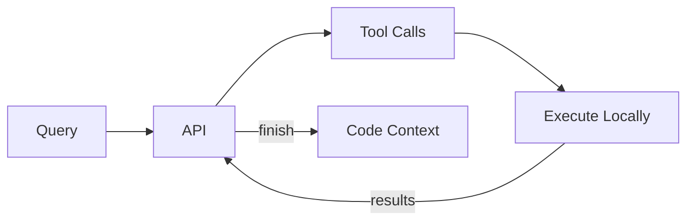

# Direct API Access

> Build your own agent harness around Warp Grep

Build your own WarpGrep harness in any language. WarpGrep is a **subagent**—a specialized model (`morph-warp-grep-v1`) that searches codebases by reasoning across multiple turns of grep, read, and list\_dir tool calls.

This page documents the raw API protocol for building custom integrations. You execute the tools locally; the API handles the reasoning.

<Note>
  For a complete implementation, see the [Python Guide](/guides/warp-grep-python). For TypeScript SDK wrappers, see [Tool](/sdk/components/warp-grep/tool).
</Note>

***

## Message Flow

The agent runs a multi-turn conversation with max 4 turns:

```
system → user → assistant → user → assistant → ... → finish
```

| Turn | Role        | Content                             |
| ---- | ----------- | ----------------------------------- |
| 0    | `system`    | System prompt with tool definitions |
| 1    | `user`      | Repo structure + search query       |
| 2    | `assistant` | Agent's tool calls                  |
| 3    | `user`      | Tool execution results              |
| 4+   | ...         | Repeat until `finish` is called     |



***

## Initial User Message

The first user message contains two parts:

1. **Repository structure** — pre-run `list_directory` at root with depth 2
2. **Search query** — what the agent needs to find

```xml  theme={null}
<repo_structure>
myproject/
  src/
    auth/
    db/
    utils/
  tests/
  config.py
  main.py
  README.md
</repo_structure>

<search_string>
Find where user authentication is implemented
</search_string>
```

***

## API Call

```bash  theme={null}
curl -X POST https://api.morphllm.com/v1/chat/completions \
  -H "Authorization: Bearer {user.morphApiKey}" \
  -H "Content-Type: application/json" \
  -d '{
    "model": "morph-warp-grep-v1",
    "messages": [
      {"role": "system", "content": "<system prompt>"},
      {"role": "user", "content": "<repo_structure>...</repo_structure>\n<search_string>Find auth middleware</search_string>"}
    ],
    "temperature": 0.0,
    "max_tokens": 2048
  }'
```

***

## Agent Response Format

The agent first thinks, then outputs tool calls using nested XML:

```xml  theme={null}
<think>
Looking for authentication. I'll grep for auth-related patterns
and explore the auth directory structure.
</think>

<grep>
  <pattern>authenticate</pattern>
  <sub_dir>src/</sub_dir>
</grep>

<grep>
  <pattern>login</pattern>
  <sub_dir>src/</sub_dir>
</grep>

<list_directory>
  <path>src/auth</path>
</list_directory>
```

***

## Tools

<Tabs>
  <Tab title="grep">
    Search for regex pattern matches using ripgrep.

    **Agent calls:**

    ```xml  theme={null}
    <grep>
      <pattern>(authenticate|authorize)</pattern>
      <sub_dir>src/auth/</sub_dir>
      <glob>*.py</glob>
    </grep>
    ```

    | Element     | Required | Description                             |
    | ----------- | -------- | --------------------------------------- |
    | `<pattern>` | Yes      | Regex pattern to search                 |
    | `<sub_dir>` | No       | Directory to search (default `.`)       |
    | `<glob>`    | No       | File filter like `*.py` or `*.{ts,tsx}` |

    **You execute:**

    ```bash  theme={null}
    rg --line-number --no-heading --color never -C 1 "(authenticate|authorize)" src/auth/ --glob "*.py"
    ```

    **You return:**

    ```xml  theme={null}
    <grep pattern="(authenticate|authorize)" sub_dir="src/auth/">
    src/auth/login.py-44-
    src/auth/login.py:45:def authenticate(username, password):
    src/auth/login.py-46-    """Validate user credentials."""
    --
    src/auth/login.py-77-
    src/auth/login.py:78:def authorize(user, resource):
    src/auth/login.py-79-    """Check if user can access resource."""
    </grep>
    ```

    **Output format:** Match lines use `:` separator (`filepath:linenum:content`), context lines use `-` separator (`filepath-linenum-content`), groups separated by `--`.
  </Tab>

  <Tab title="read">
    Read file contents with optional line ranges.

    **Agent calls:**

    ```xml  theme={null}
    <read>
      <path>src/auth/login.py</path>
      <lines>1-50</lines>
    </read>
    ```

    | Element   | Required | Description                            |
    | --------- | -------- | -------------------------------------- |
    | `<path>`  | Yes      | File path to read                      |
    | `<lines>` | No       | Line range like `1-50` or `1-20,45-80` |

    **You execute:**
    Read lines 1-50 from the file, prefix each with line number.

    **You return:**

    ```xml  theme={null}
    <read path="src/auth/login.py" lines="1-50">
    1|import hashlib
    2|import secrets
    3|from typing import Optional
    4|
    5|class AuthService:
    ...
    50|        return self.verify_token(token)
    </read>
    ```

    **Output format:** `lineNumber|content` per line
  </Tab>

  <Tab title="list_directory">
    Show directory structure as a tree.

    **Agent calls:**

    ```xml  theme={null}
    <list_directory>
      <path>src/auth</path>
      <pattern>.*\.py$</pattern>
    </list_directory>
    ```

    | Element     | Required | Description                        |
    | ----------- | -------- | ---------------------------------- |
    | `<path>`    | Yes      | Directory path (`.` for repo root) |
    | `<pattern>` | No       | Regex to filter results            |

    **You execute:**

    ```bash  theme={null}
    tree -L 3 -i -F --noreport -I "__pycache__|node_modules|.git" src/auth
    ```

    **You return:**

    ```xml  theme={null}
    <list_directory path="src/auth/">
    src/auth/
      __init__.py
      login.py
      session.py
      middleware/
        jwt.py
        oauth.py
    </list_directory>
    ```
  </Tab>

  <Tab title="finish">
    Submit final answer with file locations.

    **Agent calls:**

    ```xml  theme={null}
    <finish>
      <file>
        <path>src/auth/login.py</path>
        <lines>1-15,45-80</lines>
      </file>
      <file>
        <path>src/auth/middleware/jwt.py</path>
        <lines>*</lines>
      </file>
    </finish>
    ```

    | Element   | Required | Description                       |
    | --------- | -------- | --------------------------------- |
    | `<file>`  | Yes      | One or more file specs            |
    | `<path>`  | Yes      | File path                         |
    | `<lines>` | No       | Line ranges (`*` for entire file) |

    **You do:**
    Read the specified ranges from each file and return them as the final context. Loop ends.
  </Tab>
</Tabs>

***

## Result Format

After executing tools, wrap each result in XML tags that echo the query:

```xml  theme={null}
<grep pattern="authenticate" sub_dir="src/">
src/auth/login.py:45:def authenticate(username, password):
src/middleware/session.py:12:from auth import authenticate
</grep>

<list_directory path="src/auth/">
src/auth/
  login.py
  session.py
  middleware/
</list_directory>

<read path="src/auth/login.py" lines="1-20">
1|import hashlib
2|import secrets
...
20|    return hashed
</read>
```

***

## Turn Counter

After tool results, append a turn counter and context budget:

```
You have used 1 turn and have 3 remaining.
<context_budget>92% (147K/160K chars)</context_budget>
```

Turn messages by turn number:

| Turn | Message                                                                                                                                       |
| ---- | --------------------------------------------------------------------------------------------------------------------------------------------- |
| 1    | `You have used 0 turns and have 4 remaining`                                                                                                  |
| 2    | `You have used 1 turn and have 3 remaining`                                                                                                   |
| 3    | `You have used 2 turns and have 2 remaining`                                                                                                  |
| 4    | `You have used 3 turns, you only have 1 turn remaining. You have run out of turns to explore the code base and MUST call the finish tool now` |

***

## Output Limits

Tools enforce output limits to prevent context explosion:

| Tool             | Max Lines | On Exceed                                                                                         |
| ---------------- | --------- | ------------------------------------------------------------------------------------------------- |
| `grep`           | 200       | Replace with "query not specific enough, tool called tried to return too much context and failed" |
| `list_directory` | 200       | Same                                                                                              |
| `read`           | 800       | Truncate with warning                                                                             |

***

## Complete Example

Here's the full message flow for a 2-turn search:

<Accordion title="Turn 1: Initial request">
  **User message:**

  ```xml  theme={null}
  <repo_structure>
  myapp/
    src/
      auth/
      api/
      models/
    tests/
    package.json
  </repo_structure>

  <search_string>
  Find where JWT tokens are validated
  </search_string>
  ```

  **Assistant response:**

  ```xml  theme={null}
  <think>
  Looking for JWT validation. I'll grep for jwt-related patterns
  and check the auth directory.
  </think>

  <grep>
    <pattern>jwt|JWT</pattern>
    <sub_dir>src/</sub_dir>
  </grep>

  <grep>
    <pattern>verify.*token</pattern>
    <sub_dir>src/</sub_dir>
  </grep>

  <list_directory>
    <path>src/auth</path>
  </list_directory>
  ```
</Accordion>

<Accordion title="Turn 2: Tool results + finish">
  **User message (tool results):**

  ```xml  theme={null}
  <grep pattern="jwt|JWT" sub_dir="src/">
  src/auth/jwt.ts-14-
  src/auth/jwt.ts:15:import jwt from 'jsonwebtoken';
  src/auth/jwt.ts-16-
  --
  src/auth/jwt.ts-44-
  src/auth/jwt.ts:45:export function verifyJWT(token: string) {
  src/auth/jwt.ts-46-  return jwt.verify(token, SECRET);
  </grep>

  <grep pattern="verify.*token" sub_dir="src/">
  src/auth/jwt.ts-44-
  src/auth/jwt.ts:45:export function verifyJWT(token: string) {
  src/auth/jwt.ts-46-  return jwt.verify(token, SECRET);
  --
  src/middleware/auth.ts-22-
  src/middleware/auth.ts:23:  const valid = verifyToken(req.headers.authorization);
  src/middleware/auth.ts-24-  if (!valid) return res.status(401).send();
  </grep>

  <list_directory path="src/auth">
  src/auth/
    index.ts
    jwt.ts
    session.ts
  </list_directory>

  You have used 1 turn and have 3 remaining.
  <context_budget>94% (150K/160K chars)</context_budget>
  ```

  **Assistant response:**

  ```xml  theme={null}
  <think>
  Found the JWT validation in src/auth/jwt.ts and it's used in middleware.
  I have enough context to finish.
  </think>

  <finish>
    <file>
      <path>src/auth/jwt.ts</path>
      <lines>1-60</lines>
    </file>
    <file>
      <path>src/middleware/auth.ts</path>
      <lines>1-40</lines>
    </file>
  </finish>
  ```
</Accordion>

***

## System Prompt

<Accordion title="View full system prompt">
  ```
  `You are a code search agent. Your task is to find all relevant code for a given search_string.

  ### workflow
  You have exactly 4 turns. The 4th turn MUST be a \`finish\` call. Each turn allows up to 8 parallel tool calls.

  - Turn 1: Map the territory OR dive deep (based on search_string specificity)
  - Turn 2-3: Refine based on findings
  - Turn 4: MUST call \`finish\` with all relevant code locations
  - You MAY call \`finish\` early if confident—but never before at least 1 search turn.
  - The user strongly prefers if you can call the finish tool early, but you must be correct

  Remember, if the task feels easy to you, it is strongly desirable to call 'finish' early using fewer turns, but quality over speed

  ### tools
  Tool calls use nested XML elements:
  \`\`\`xml
  <tool_name>
    <parameter>value</parameter>
  </tool_name>
  \`\`\`

  ### \`list_directory\`
  Directory tree view. Shows structure of a path, optionally filtered by regex pattern.

  Elements:
  - \`<path>\` (required): Directory path to list (use \`.\` for repo root)
  - \`<pattern>\` (optional): Regex to filter results

  Examples:
  \`\`\`
  <list_directory>
    <path>src/services</path>
  </list_directory>

  <list_directory>
    <path>lib/utils</path>
    <pattern>.*\\.(ts|js)$</pattern>
  </list_directory>
  \`\`\`

  ### \`read\`
  Read file contents. Supports multiple line ranges.
  - Returns numbered lines for easy reference
  - ALWAYS include import statements (usually lines 1-20). Better to over-include than miss context.

  Elements:
  - \`<path>\` (required): File path to read
  - \`<lines>\` (optional): Line ranges like "1-50,75-80,100-120" (omit to read entire file)

  Examples:
  \`\`\`
  <read>
    <path>src/main.py</path>
  </read>

  <read>
    <path>src/auth.py</path>
    <lines>1-20,45-80,150-200</lines>
  </read>
  \`\`\`

  ### \`grep\`
  Search for pattern matches across files. Returns matches with 1 line of context above and below.
  - Match lines use \`:\` separator → \`filepath:linenum:content\`
  - Context lines use \`-\` separator → \`filepath-linenum-content\`

  Elements:
  - \`<pattern>\` (required): Search pattern (regex). Use \`(a|b)\` for OR patterns.
  - \`<sub_dir>\` (optional): Subdirectory to search in (defaults to \`.\`)
  - \`<glob>\` (optional): File pattern filter like \`*.py\` or \`*.{ts,tsx}\`

  Examples:
  \`\`\`
  <grep>
    <pattern>(authenticate|authorize|login)</pattern>
    <sub_dir>src/auth/</sub_dir>
  </grep>

  <grep>
    <pattern>class.*(Service|Controller)</pattern>
    <glob>*.{ts,js}</glob>
  </grep>

  <grep>
    <pattern>(DB_HOST|DATABASE_URL|connection)</pattern>
    <glob>*.{py,yaml,env}</glob>
    <sub_dir>lib/</sub_dir>
  </grep>
  \`\`\`

  ### \`finish\`
  Submit final answer with all relevant code locations. Uses nested \`<file>\` elements.

  File elements:
  - \`<path>\` (required): File path
  - \`<lines>\` (optional): Line ranges like "1-50,75-80" (\`*\` for entire file)

  ALWAYS include import statements (usually lines 1-20). Better to over-include than miss context.

  Examples:
  \`\`\`
  <finish>
    <file>
      <path>src/auth.py</path>
      <lines>1-15,25-50,75-80</lines>
    </file>
    <file>
      <path>src/models/user.py</path>
      <lines>*</lines>
    </file>
  </finish>
  \`\`\`
  </tools>

  <strategy>
  **Before your first tool call, classify the search_string:**

  | Search_string Type | Round 1 Strategy | Early Finish? |
  |------------|------------------|---------------|
  | **Specific** (function name, error string, unique identifier) | 8 parallel greps on likely paths | Often by round 2 |
  | **Conceptual** (how does X work, where is Y handled) | list_directory + 2-3 broad greps | Rarely early |
  | **Exploratory** (find all tests, list API endpoints) | list_directory at multiple depths | Usually needs 3 rounds |

  **Parallel call patterns:**
  - **Shotgun grep**: Same pattern, 8 different directories—fast coverage
  - **Variant grep**: 8 pattern variations (synonyms, naming conventions)—catches inconsistent codebases
  - **Funnel**: 1 list_directory + 7 greps—orient and search simultaneously
  - **Deep read**: 8 reads on files you already identified—gather full context fast

  **Tool call expectations:**
  - Low quality tool calls are ones that give back sparse information. This either means they are not well thought out and are not educated guesses OR, they are too broad and give back too many results.
  - High quality tool calls strike a balance between complexity in the tool call to exclude results we know we don't want, and how wide the search space is so that we don't miss anything. It is ok to start off with wider search spaces, but is imperative that you use your intuition from there on out and seek high quality tool calls only.
  - You are not starting blind, you have some information about root level repo structure going in, so use that to prevent making trivial repo wide queries.
  - The grep tool shows you which file path and line numbers the pattern was found in, use this information smartly when trying to read the file.
  </strategy>

  <output_format>
  EVERY response MUST follow this exact format:

  1. First, wrap your reasoning in \`<think>...</think>\` tags containing:
     - Search_string classification (specific/conceptual/exploratory)
     - Confidence estimate (can I finish in 1-2 rounds?)
     - This round's parallel strategy
     - What signals would let me finish early?

  2. Then, output up to 8 tool calls using nested XML elements.

  Example:
  \`\`\`
  <think>
  This is a specific search_string about authentication. I'll grep for auth-related patterns.
  High confidence I can finish in 2 rounds if I find the auth module. I have already been shown the repo's structure at root
  Strategy: Shotgun grep across likely directories.
  </think>
  <grep>
    <pattern>(authenticate|login|session)</pattern>
    <sub_dir>src/auth/</sub_dir>
  </grep>
  <grep>
    <pattern>(middleware|interceptor)</pattern>
    <glob>*.{ts,js}</glob>
  </grep>
  <list_directory>
    <path>src/auth</path>
  </list_directory>
  \`\`\`

  Finishing example:
  \`\`\`
  <think>
  I think I have a rough idea, but this is my last turn so I must call the finish tool regardless.
  </think>
  <finish>
    <file>
      <path>src/auth/login.py</path>
      <lines>1-50</lines>
    </file>
    <file>
      <path>src/middleware/session.py</path>
      <lines>10-80</lines>
    </file>
  </finish>
  \`\`\`

  No commentary outside \`<think>\`. No explanations after tool calls.
  </output_format>

  <finishing_requirements>
  When calling \`finish\`:
  - Include the import section (typically lines 1-20) of each file
  - Include all function/class definitions that are relevant
  - Include any type definitions, interfaces, or constants used
  - Better to over-include than leave the user missing context
  - If unsure about boundaries, include more rather than less
  </finishing_requirements>`
  ```
</Accordion>

***

## Implementation Guide

For a complete working implementation, see the [Python Guide](/guides/warp-grep-python) which covers:

* API call function
* XML parsing for tool calls
* Tool executors (ripgrep, file reads, tree)
* Result formatters
* Complete agent loop


---

> To find navigation and other pages in this documentation, fetch the llms.txt file at: https://docs.morphllm.com/llms.txt
